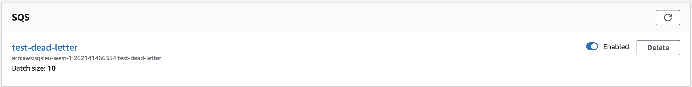

I came across an incident recently where data was going to a service via SQS, upon hitting that service it would then talk to a bunch of other services to gather more data for the request. At the same time, an attack had taken down the connection to those other services which was causing our requests to fail and move to our dead letter queue.

Now, these requests weren’t broken, they were just victim to a one-off transient error. The data within the request was perfectly valid. But, at this time, the dead letter queue was used more for logging the very occasional permanent error that had occurred and being able to replay those items was never needed.

Because of that incident, I wanted to build something that could be turned on at a moments notice and be used to replay messages in the dead letter queue, albeit temporarily.

At first, I was toying with the idea of creating a generic CLI tool to run from my machine. It would simply poll the DLQ and replay those items on to the main queue. But I didn't like the idea of having a random script on my laptop that only I could run to solve a fundamental issue that was likely to happen again.

What we needed was a CLI tool like above, but we need it to be in a generic location for anyone to configure and run.

Lambda seemed to be a good fit for this. With a Lambda we can have all of the code stored in one place. Preconfigured, with the triggers disabled. Then only when we need to, enable them to start replaying messages.

Plus Lambda's are simple, we only need to specify a queue to trigger the Lambda against and a queue to replay those items too. So when we start getting notified via our CloudWatch alarms that the DLQ is filling up we can diagnose the issue and at the right time replay those items.

The code itself is very simple. When the Lambda is triggered, it loops over the records that come in and simply forwards that message onto the output queue defined in an environment variable. Which then means the services listening to the output queue can start reprocessing the messages that had failed. 🎉🎉🎉

The full source code can be found here: [dulldave/aws-sqs-dead-letter-replay-lambda](https://github.com/dulldave/aws-sqs-dead-letter-replay-lambda)
